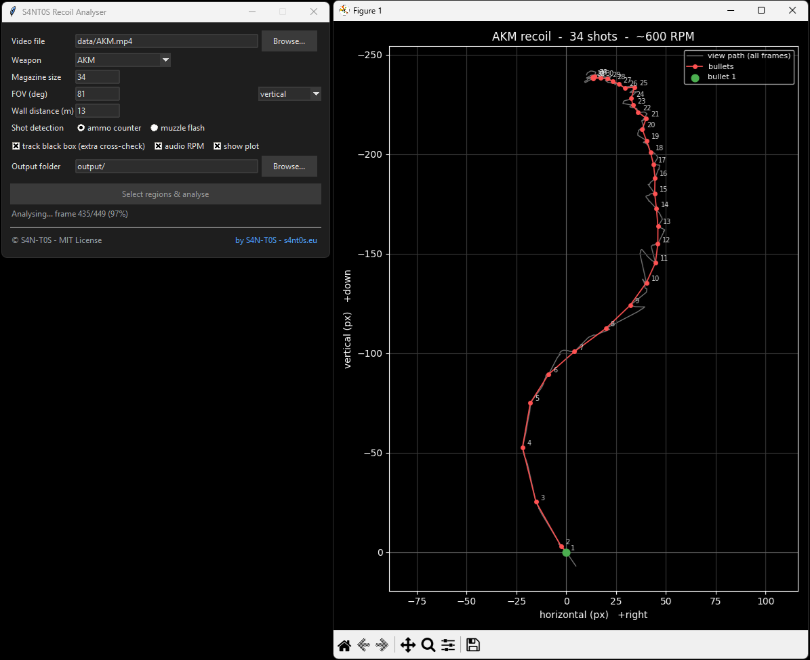
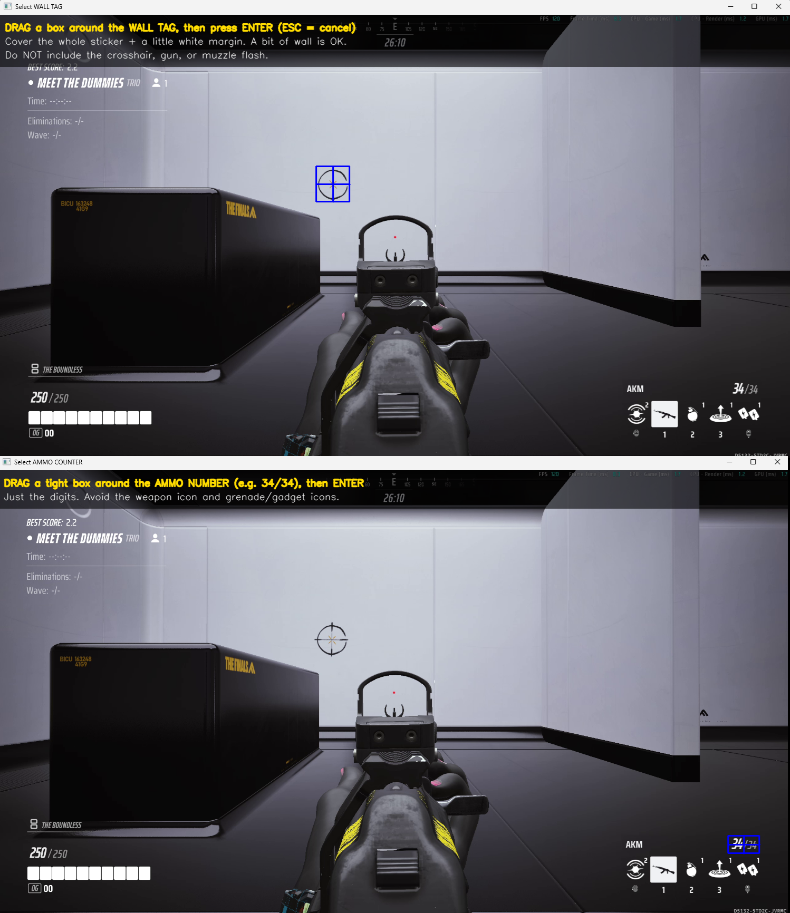

# S4NT0S Recoil Analyser

Extracts a weapon's **recoil pattern** from a gameplay clip and exports it to
JSON. Recoil is measured by tracking a fixed
feature on the wall you fire at: as the gun kicks the *view* up/right, that wall
feature slides the opposite way on screen, so its motion (negated) **is** the
recoil trajectory.

It also reports the weapon's **rate of fire (RPM)** and the recoil in three
units: screen pixels, view degrees, and centimetres on the wall.

> The defaults (FOV 81 vertical, 13 m, AKM/34) are tuned for **The Finals**, but
> the method is game-agnostic — it works for **any first-person shooter** once
> you set the FOV, wall distance, magazine size and ROIs for your game.



---

## How to record footage (read this first)

The analysis is only as good as the clip. Follow this protocol:

1. **Stand ~13 m from a flat white wall** (the practice range works well). Keep
   the distance consistent between recordings — it's used for the cm figures.
2. **Put a small high-contrast sticker/tag on the wall**, ideally toward a
   corner of the screen (top-left in the reference clip) so it never collides
   with the crosshair or muzzle flash. This tag is the primary tracking target,
   so it must stay **fully in frame for the whole burst** — recoil moves it, so
   leave margin in the direction the gun climbs (usually downward on screen).
3. **Fire with a keyboard bind, not the mouse**, so the only view movement is
   recoil — never accidental aim input. Do **not** move the mouse while firing.
4. **Empty the full magazine** in one continuous burst at the wall.
5. **Capture settings** (what the tool is tuned for):
   - 1440p (2560×1440), **120 FPS** — high FPS gives accurate per-shot timing.
   - Default **FOV 81** (The Finals reports a *vertical* FOV), native resolution.
   - All **textures / detail / anti-aliasing on LOW/off** — less visual noise
     means cleaner tracking.
   - Near-lossless capture (e.g. OBS **CQP** ~14).
   - **Keep the audio track** if you want an independent RPM cross-check.
6. **Trim the clip tightly**: first frame = full mag shown, *no shot yet*; the
   next frame is the first shot; end a handful of frames after the last shot.
   (Reference clip: AKM, 34 rounds, 403 frames — frame 0 = `34/34`, frame 1 =
   first shot, ends ~6 frames after the last round.)

   To cut **frame-accurately without re-encoding** (so quality is untouched and
   it's instant), use **[LosslessCut](https://github.com/mifi/lossless-cut#download)**
   — a free, open-source trimmer. Open the recording, step frame-by-frame (using **,** and **.**) to the
   frame *just before* the first shot, set the start there; set the end a few
   frames after the last shot; export. Because it stream-copies rather than
   re-encodes, the output stays at your original CQP quality.

**Resolution and frame rate are auto-detected** from the file — no code edits
needed for 1080p or 60 fps. **1440p / 120 fps is recommended**
though: a higher frame rate makes RPM and per-shot timing more precise. Note that
raw pixel values scale with resolution, so to compare recoil across different
captures use the resolution-independent **degrees / cm** fields rather than
`x`/`y` pixels.

Put clips in `data/`. Exports land in `output/`.

### Example clip & drawing reference image

A trimmed example lives at **`data/AKM.mp4`** (compressed). Use it to see exactly how a
clip should look and be cut. Please do not compress your analysis clips.



<video src="https://github.com/S4N-T0S/recoil-analyser/raw/main/data/AKM.mp4" controls width="640">
  Your browser can't play this embed —
  <a href="https://github.com/S4N-T0S/recoil-analyser/raw/main/data/AKM.mp4">example clip</a>.
</video>

---

## Install

Requires **Python 3.11+** and **ffmpeg** on `PATH` (only for the optional audio
RPM cross-check).

```bash
pip install -r requirements.txt
```

---

## Usage

### GUI (recommended)

```bash
python -m recoil_analyser
```

1. Browse to your clip, pick the weapon (sets magazine size), set FOV / distance.
2. Click **Select regions & analyse**. A popup shows the first frame with
   **on-image instructions** for each region you draw:
   - the **wall tag** (required),
   - the **ammo counter** number (for shot detection — the default method), and
   - optionally the **black box** crate (a second reference for a sanity check).
   Drag a rectangle, press **ENTER** to confirm, **ESC** to cancel/skip.
3. It writes `output/<clip>_<weapon>.json` + a `.png` plot and shows a summary.

**How tightly to draw:** include the whole tag plus a *little* margin — a bit of
white wall around it is fine and even helps. The box does **not** need to hug
the tag's edges. The only hard rule: never include things that move differently
from the wall (the crosshair, the gun model, the muzzle flash). For the optional
crate, pick a small high-contrast corner *on* the crate rather than the whole
object — a huge ROI tracks worse.

The picker shows a down-scaled view of the 1440p frame and maps your selection
back to full resolution automatically.

### CLI (headless / scriptable)

```bash
python -m recoil_analyser.cli \
    --video data/akm.mp4 --weapon AKM --magazine 34 \
    --tag 60 110 240 90 --ammo 2360 1320 150 60 \
    --box 90 470 520 380          # optional
```

Omit `--tag` / `--ammo` to be prompted to draw them. Useful flags:
`--method {ammo,muzzle}`, `--fov 81`, `--fov-axis vertical`,
`--distance 13`, `--no-audio`, `--no-plot`, `--no-trajectory`, `--out path.json`.

---

## How it works

| Step | Method |
| --- | --- |
| **Tracking** | Sub-pixel template matching (normalised cross-correlation) of the frame-0 tag against every frame, refined by a parabolic fit on the correlation peak. Always matched against frame 0, so it never drifts. The gun model, weapon sway and FOV "punch" are ignored because we track the *wall*, not the gun. |
| **Aim trajectory** | `aim = −(tag_position − tag_position_at_frame_0)`. Pure view rotation moves every world point by the same number of pixels, so the tag's screen motion equals the aim point's motion (negated). |
| **Shot detection** | *ammo* (default): per-frame change inside the ammo-counter ROI spikes when a round is consumed; we keep the strongest `magazine` peaks. *muzzle*: brightness peaks in a muzzle ROI. |
| **RPM** | `60 · fps · (n−1) / (last_shot_frame − first_shot_frame)` — the total-span form minimises 120 fps quantization error. Audio onset detection (via ffmpeg) provides an independent cross-check. |
| **Units** | Pinhole model: `focal_px = (axis_size/2) / tan(fov/2)` where `axis_size` is the height for a vertical FOV (The Finals' default) or width for horizontal; degrees `= atan(Δpx / focal_px)`; cm on wall `= distance · Δpx / focal_px`. |

### Coordinate convention

Screen pixels, **+x = right, +y = down**. A normal upward kick therefore shows
as **negative y**. The per-bullet `pattern` is relative to bullet 1 (so
bullet 1 = `0, 0`); the full per-frame `trajectory` is included for animation.

---

## Output JSON

```jsonc
{
  "weapon": "AKM",
  "capture": { "fps": 120, "width": 2560, "height": 1440,
               "fov_deg": 81, "fov_axis": "vertical",
               "distance_m": 13, "focal_px": 842.6 },
  "magazine": 34,
  "shots_detected": 34,
  "rpm": { "video_span": 720.0, "video_median": 720.0, "audio": 718.4,
           "intervals_frames": [10, 10, ...] },
  "tracking": { "feature": "tag", "min_confidence": 0.97,
                "box_crosscheck": { "mean_abs_diff_px": 0.4 } },
  "pattern": [                       // one entry per bullet, relative to bullet 1
    { "bullet": 1, "frame": 1,  "time_s": 0.008, "x": 0.0,  "y": 0.0,
      "dx_deg": 0.0,  "dy_deg": 0.0,  "dx_cm": 0.0,  "dy_cm": 0.0 },
    { "bullet": 2, "frame": 11, "time_s": 0.092, "x": -4.9, "y": -19.8,
      "dx_deg": -0.19, "dy_deg": -0.76, "dx_cm": -4.3, "dy_cm": -17.2 }
  ],
  "trajectory": [ { "frame": 0, "time_s": 0.0, "x": 0.0, "y": 0.0,
                    "confidence": 1.0 }, ... ]   // per-frame view path
}
```

`tracking.min_confidence` is your quality gauge — values near 1.0 mean the tag
was tracked cleanly. If it drops (e.g. the tag left frame or motion blur), the
affected bullets are suspect. The `box_crosscheck` compares the recoil derived
from the box against the tag; a large difference points to parallax/translation
or a tracking failure.

---

## Validation

`tools/validate.py` renders a synthetic clip with a *known* injected recoil
pattern, runs the analyser, and asserts the recovered pattern, shot frames and
RPM match. Current recovery error is ~0.02 px.

```bash
python tools/validate.py
```

---

## Project layout

```
recoil_analyser/
  geometry.py    px ↔ degrees ↔ cm (pinhole model)
  tracking.py    sub-pixel template tracker
  detection.py   shot detection + RPM from frames
  audio.py       optional audio-onset RPM (ffmpeg)
  core.py        single-pass analysis → result dict
  export.py      JSON + matplotlib plot
  roi_select.py  scaled cv2.selectROI helper
  gui.py         Tkinter front-end
  cli.py         argparse front-end
tools/           synthetic test video + validation
data/            raw clips (git-ignored, except example AKM.mp4)
output/          exports (git-ignored)
```

---

## License & credits

© 2026 **[S4N-T0S](https://s4nt0s.eu)** — released under the
[MIT License](LICENSE).

Author: **https://s4nt0s.eu**  ·  Source: **https://github.com/S4N-T0S/recoil-analyser**

Built with [OpenCV](https://opencv.org/), [NumPy](https://numpy.org/) and
[Matplotlib](https://matplotlib.org/); clip trimming via
[LosslessCut](https://github.com/mifi/lossless-cut).
